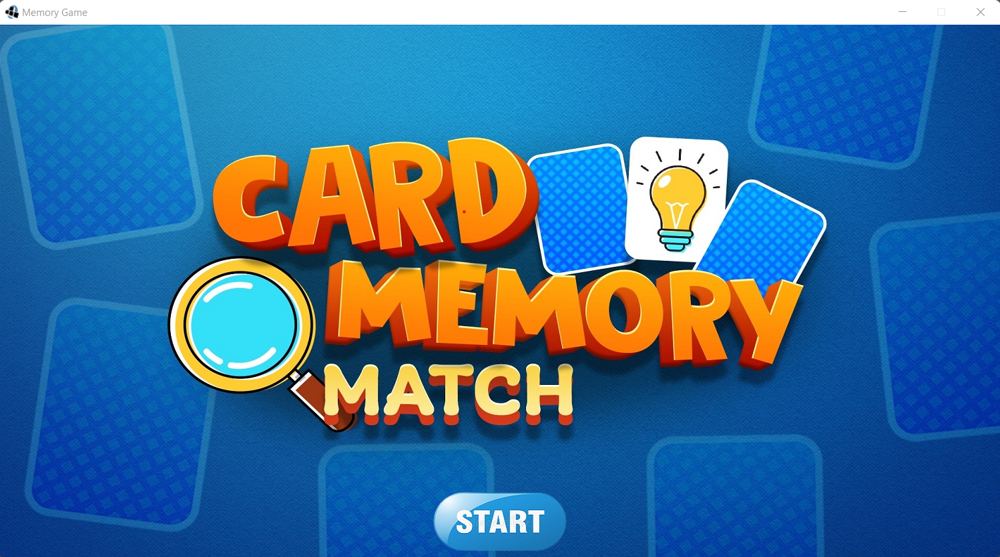

  <h1 align="center">
        Memory Game
  </h1>

  <h3 align="center">A reproduction of the memory game application.</h3>
  <a href="https://www.linkedin.com/posts/pedro-le-prince-djampou-366122240_video-java-ugcPost-7021531611791831041-5lu7?utm_source=share&utm_medium=member_desktop">
  Click here to see a demo.
  </a>

 

## Goal of the project

The goal of making a memory game is to create a board or board game that tests
players' memory by asking them to find pairs or triplets of identical cards in
a set of shuffled cards, while having a time limit to do so. The game can be 
designed to be played individually or in groups, with different difficulty 
levels for different age groups and skill levels. The aim is to stimulate
players' memory and concentration, while providing a fun and entertaining 
challenge.

## User eXperience(UX)
### Strategy

__App Objective__: The Memory Game is often used as an educational game for children, but can also be a fun pastime for adults..

__User Needs__: play, choose a game mode (number of cards to validate, game mode and game theme), design and level.

Opportunities/Problems table used to determine the strategic priorities UX efforts should address (in this order):

| Opportunity/Problem                                                          | Importance | Viability/Feasibility |
| :--------------------------------------------------------------------------: | :--------: | :-------------------: |
| A. Have a functional game                                                    |     5      |           5           |
| B. Have an ergonomic interface                                               |     5      |           5           |
| C. Have the ability to choose a game mode, design and level                  |     5      |           5           |
| D. Have the option to start the next level after completing the previous one |     2      |           5           |
| E. Have an interactive interface                                             |     2      |           5           |

### Scope

#### Functional Specifications

While reviewing the functional specs, I looked at existing memory game apps,
including memory card game apps that exist on windows and android. 
This helped me identify key features that memory game app users expect to see.

#### Feature set:
* Choose a game mode
* Choose a game theme
* Choose a validation of the game
* Choose a level
* Choose a player number
* Choose a design

### Structure

#### Interaction Design

__Consistency & Predictability:__

- Common interface.
- Sober and clear, but consistent colors to highlight the different tools and bring out the design of the user.
- Separate the different areas of the application to allow better navigation. Thus, we have a reception area, for the settings, for the help and for the game.

__Feedback:__

All interactive elements react to a user's mouse hover to encourage interaction and provide confirmation when actions are taken.

- Mouse changes shape when hovering over certain objects.
- Tools are highlighted on hover.
- The drop-down menu is animated and interactive.
- Maps are animated when clicked.
- the tutorials present in the setting in the form of a kind of video explain how the game works.
- navigation between the different pages is very fluid.

### Surface

App's Colors: 

- LIGHT : WHITE `#ffffff`, LIGHTGRAY `#c3c3c3`, LIGHTYELLOW `#efe4b0`, LIGHTTURQUOISE `#99d9ea`, LIGHTGOLD `#ffc90e40`.
- DARK: BLACK `#333333`, DARKRED `#880015`, DARKWHITE `#fafafa`.
- PALE: PALEGRAY `#f9f1ee`, `#f6f6f6`.
- SMOOTH: SMOOTHGRAY `#f8f8f8`.
- FONT: `#222222`.
- TRANSPARENT: TRANSPARENT `#ffffff11`, TRANSPARENTGRAY `#cccccc40`.

App's Title Font: `Algerian`.
App's Simple Font: `Snap ITC`.

### Existing Features

1. The user can choose game mode.
2. The user can choose game theme.
3. The user can choose game level.
4. The user can choose game validation mode.
5. The user can choose the number of players.
6. The card can be mobile or not.
7. The user can choose game desing. 

### Features to add

| Label        | Description   |
|:-----------: |:------------: |
| save part of the game | Consists of storing a description of the game in a file. |
| play online | To play together on remote machines |
| create your image pack | customize your own image pack yourself |

## Technologies Used

- [Java](https://fr.wikipedia.org/wiki/Java_(langage))
- [Slick2D](https://slick.ninjacave.com/javadoc/) : An easy to use set of tools and utilites wrapped around LWJGL OpenGL bindings to make 2D Java game development easier. See the documentation for more information.
- [Eclipse IDE](https://www.eclipse.org) : My code editor in Java.

## Testing 

Extensive manual testing has been carried out to ensure that the application works and displays correctly on any Windows computer.

The following tests passed: 

| Test No. | Test Name                                        | Result |
|:---------|:-------------------------------------------------|:-------|
|    1     |  Simple design inspired by other games           |  PASS  |
|    2     |  cards can move randomly keeping their state.    |  PASS  |
|    3     |  smooth navigation between the different pages   |  PASS  |
|    4     |  Stable & speed application                      |  PASS  |
|    5     |  communication of information between the different pages |  PASS  |
|    6     |  Advance to the next level at the end of a game  |  PASS  |
|    7     |  the game ends once the time limit has elapsed   |  PASS  |
|    8     |  the game ends once the allowed number of tries has been used |  PASS  |
|    9     |  Can be used in Windows 8, 8.1, 10 and 11        |  PASS  |

## Deployment 

### Creation of the JAR

I use Eclipse. So I had to proceed as follows:

1. Right click on the project > Click on `export` > `JAR file`.
2. Choose the resources you want to put in the JAR.
3. Choose the options you want >  Enter the destination address of your JAR > Click on `next`.
4. Click on next >  Enter the class containing the main.
5. Click on `finish`.

### Creation of the app launcher (.exe)

A launcher is simply a native program that will run your own program. You must therefore have already created a .jar before creating a launcher.

To convert my .jar file to a .exe file, I used the online converter : [convertio.co](https://convertio.co/fr/convertisseur-jar/).

## Credits

### Images 

images and icons are from several sources on Google

### Acknowledgements

Big thanks to my friends and family for help with testing and feedback.
